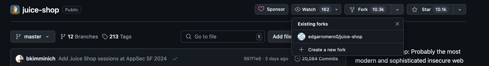
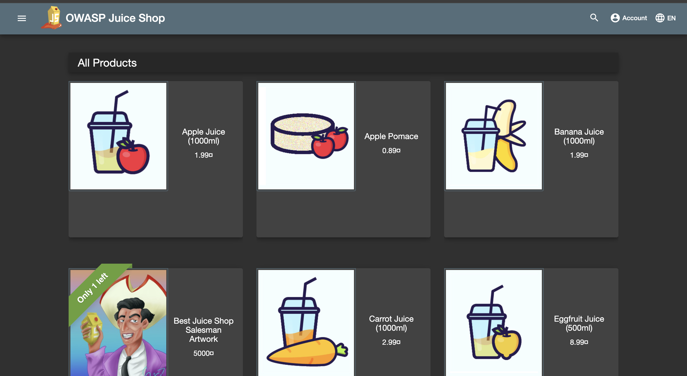
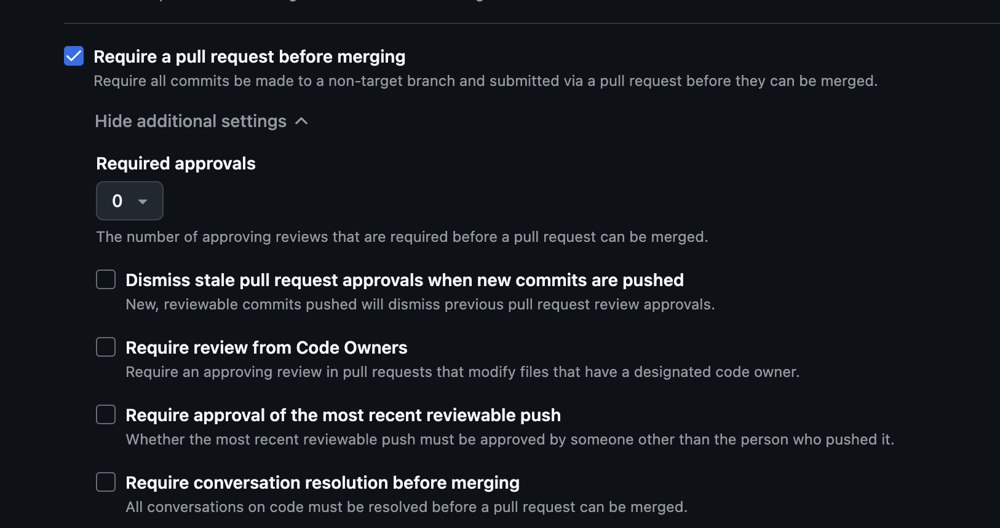
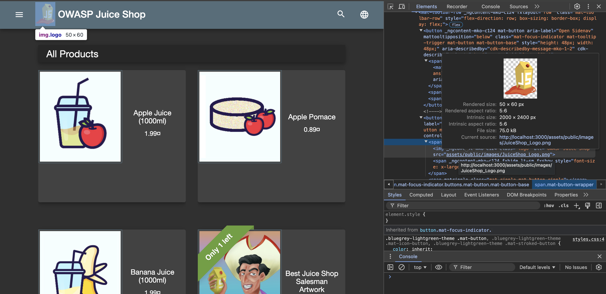
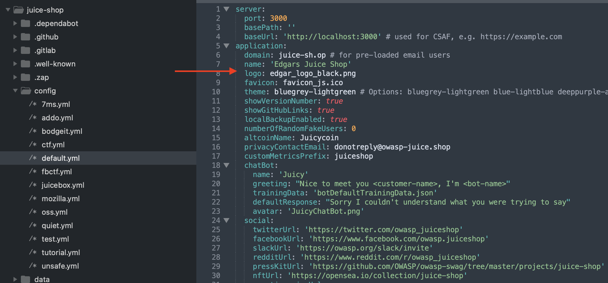
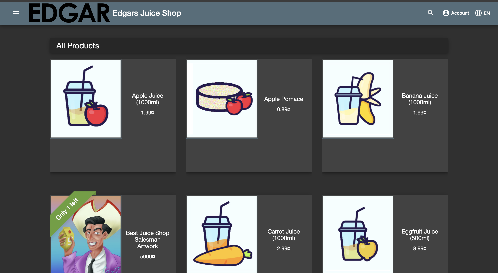

# Technical Exercise

#### Prerequisite Software already installed and set up 
[Docker Desktop](https://docs.docker.com/desktop/install/mac-install/) 
[Git](https://git-scm.com/download/mac) 
[Sublime Text](https://www.sublimetext.com/download_thanks?target=mac)

### 1)  Application Used
For this exercise I used [OWASP Juice Shop](https://github.com/juice-shop/juice-shop) as it was the first on the list and had good documentation and set up instructions. 

### 2)  Forking To Github
 Having chosen the application, I used an existing  GitHub account to fork the application. From the top right option:

### 3) Cloning the Repository
With Git already installed, I then used the following command in terminal to clone the repository:
  
`git clone https://github.com/edgarromero0/juice-shop.git`

### 4) Running the Application
Given that the project was very well documented, I followed the instructions under Docker Container to quickly get it up and running after forking it.  
  

### 5) Homepage
With the application now running on my local machine on port 3000. I was able to get to the home   

### 6) Creating this File
Using Sublime Text, I was able to create an .md file called output.md to stylize the steps taken above

### 7) Merging to Master Branch
It is not best practice to commit directly to the master branch as it lacks code review which can lead to potential breaking changes. To avoid this it would be best to create a branch for each change. Then merge it into the master branch via a pull requests  after code review. For instance you can require PRs configure the repository to require PRs Branch protection rules shown below:  

### 8) Replacing WebGoat Image

Using developer tools I was able to find the logo of the main homepage under:  
…/juice-shop/frontend/src/assets/public/images/ 

From there I noticed that all images are in the default.yml file. From there a quick change to point to new images

Where the final result is:  
  

### 9) Final URL:  
  
[https://github.com/edgarromero0/juice-shop/tree/master](https://github.com/edgarromero0/juice-shop/tree/master)